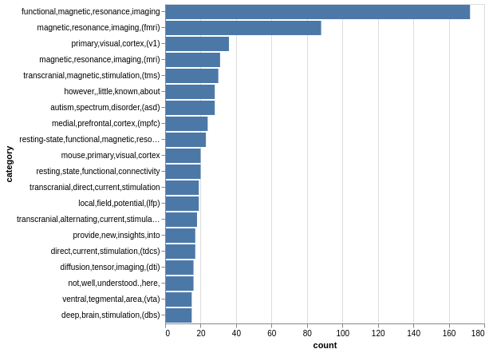

# neuroscience-biorxiv-topics

Quick and dirty results:
(Warning: I am a astrophysicist. So the prior I put on filtering the words might be inappropiate. The purpose of this page is just for me to learn some important terminologies or projects in current neuroscience research.)

- 1-gram:


```python
# 1-gram, num of counts in the abstracts
[(('brain',), 3888),
 (('between',), 2968),
 (('neural',), 2890),
 (('activity',), 2599),
 (('not',), 2483),
 (('neurons',), 2360),
 (('visual',), 2312),
 (('functional',), 1970),
 (('model',), 1863),
 (('cortical',), 1641),
 (('however,',), 1634),
 (('two',), 1588),
 (('found',), 1524),
 (('human',), 1518),
 (('different',), 1508),
 (('network',), 1473),
 (('more',), 1457),
 (('information',), 1418),
 (('cortex',), 1372),
 (('connectivity',), 1299)]
```

It's not so surprise to see `brain` to be the top.
They are neuroscience articles after all.
It's interesting to see `between` and `connectivity` appear to be on the top rank.
Somewhat means neuroscience is more about the interacting or coupling terms (sorry I use Physics terminology).

- 2-grams:
    - Some link to the wiki pages of terminologies:
    - [white matter](https://en.wikipedia.org/wiki/White_matter)
    - [visual cortex](https://en.wikipedia.org/wiki/Visual_cortex)
    - [functional connectivity](https://en.wikipedia.org/wiki/Dynamic_functional_connectivity)


```python
# 2-grams, num of counts in the abstracts
[(('functional', 'connectivity'), 401),
 (('neural', 'activity'), 330),
 (('did', 'not'), 315),
 (('magnetic', 'resonance'), 283),
 (('visual', 'cortex'), 278),
 (('relationship', 'between'), 276),
 (('white', 'matter'), 271),
 (('working', 'memory'), 251),
 (('brain', 'regions'), 240),
 (('resonance', 'imaging'), 233),
 (('prefrontal', 'cortex'), 208),
 (('findings', 'suggest'), 207),
 (('rather', 'than'), 206),
 (('brain', 'activity'), 202),
 (('functional', 'magnetic'), 192),
 (('not', 'only'), 168),
 (('does', 'not'), 167),
 (('gene', 'expression'), 163),
 (('do', 'not'), 158),
 (('poorly', 'understood.'), 148)]
```

The terms related to interacting and coupling are on the top rank,
`functional connectivity`, `relationship between`, ...
(Heh, I learned some new neuroscience words through 2-grams.)

- 3-grams:
    - Lots of important words were found by 3-grams!
    - [magnetic resonance imaging](https://en.wikipedia.org/wiki/Magnetic_resonance_imaging)
    - little known about: apparently, `little known about` is important in neuroscience!
    - [autism spectrum disorder](https://en.wikipedia.org/wiki/Autism_spectrum): Hmmm, I heard about this before but did not know it could be studied by neuroscience.
    - [medial prefrontal cortex](https://en.wikipedia.org/wiki/Prefrontal_cortex)
    - not well understood: apparently, is related to `little known about`!
    -  [transcranial magnetic stimulation](https://en.wikipedia.org/wiki/Transcranial_magnetic_stimulation)
    -  [human connectome project](http://www.humanconnectomeproject.org/about/): this is a quite interesting project
       -  quoted from the official website: > The Human Connectome Project aims to provide an unparalleled compilation of neural data, an interface to graphically navigate this data and the opportunity to achieve never before realized conclusions about the living human brain.
    -  [deep brain stimulation](https://en.wikipedia.org/wiki/Deep_brain_stimulation)


```python
# 3-grams, num of counts in the abstracts
[(('magnetic', 'resonance', 'imaging'), 233),
 (('functional', 'magnetic', 'resonance'), 192),
 (('little', 'known', 'about'), 109),
 (('primary', 'visual', 'cortex'), 92),
 (('resonance', 'imaging', '(fmri)'), 88),
 (('autism', 'spectrum', 'disorder'), 61),
 (('medial', 'prefrontal', 'cortex'), 61),
 (('not', 'well', 'understood.'), 53),
 (('transcranial', 'magnetic', 'stimulation'), 51),
 (('central', 'nervous', 'system'), 46),
 (('anterior', 'cingulate', 'cortex'), 45),
 (('visual', 'cortex', '(v1)'), 43),
 (('human', 'connectome', 'project'), 41),
 (("alzheimer's", 'disease', '(ad)'), 41),
 (('functional', 'connectivity', 'between'), 41),
 (('resting', 'state', 'functional'), 39),
 (('remain', 'poorly', 'understood.'), 38),
 (('local', 'field', 'potential'), 37),
 (('neural', 'mechanisms', 'underlying'), 33),
 (('deep', 'brain', 'stimulation'), 33)]
```

- 4-grams:

Nice, 4-grams teach me about acronyms!



```python
# 4-grams, num of counts in the abstracts
[(('functional', 'magnetic', 'resonance', 'imaging'), 172),
 (('magnetic', 'resonance', 'imaging', '(fmri)'), 88),
 (('primary', 'visual', 'cortex', '(v1)'), 36),
 (('magnetic', 'resonance', 'imaging', '(mri)'), 31),
 (('transcranial', 'magnetic', 'stimulation', '(tms)'), 30),
 (('however,', 'little', 'known', 'about'), 28),
 (('autism', 'spectrum', 'disorder', '(asd)'), 28),
 (('medial', 'prefrontal', 'cortex', '(mpfc)'), 24),
 (('resting-state', 'functional', 'magnetic', 'resonance'), 23),
 (('mouse', 'primary', 'visual', 'cortex'), 20),
 (('resting', 'state', 'functional', 'connectivity'), 20),
 (('transcranial', 'direct', 'current', 'stimulation'), 19),
 (('local', 'field', 'potential', '(lfp)'), 19),
 (('transcranial', 'alternating', 'current', 'stimulation'), 18),
 (('provide', 'new', 'insights', 'into'), 17),
 (('direct', 'current', 'stimulation', '(tdcs)'), 17),
 (('diffusion', 'tensor', 'imaging', '(dti)'), 16),
 (('not', 'well', 'understood.', 'here,'), 16),
 (('ventral', 'tegmental', 'area', '(vta)'), 15),
 (('deep', 'brain', 'stimulation', '(dbs)'), 15)]
```

## Use of the RCategory class

1. Use downloaded `rxivist_neuroscience.json` file directly

```python
# load data
r = RCategory('jibancat@mail.com', 'jibancat', timeframe='alltime', category='neuroscience', filename='rxivist_neuroscience.json')

# plot 3-grams (first 20 items)
r.plot_bars(r.n_grams(3), n=20).serve()
```

2. Fetch raw data using Rxivist API

```python
# load data
r = RCategory('jibancat@mail.com', 'jibancat', timeframe='alltime', category='neuroscience')

r.fetch()
r.to_json()
```

## Link to Rxivist API

https://rxivist.org/

> Abdill RJ, Blekhman R. "Tracking the popularity and outcomes of all bioRxiv preprints." eLife (2019). doi: 10.7554/eLife.45133.

## LDA Topic Modeling

The representative topics captured from biorxiv.neuroscience.

Topic 0 : memory, age, increased, changes, associated, related, differences, showed, brain, findings, compared, observed, effects, study, effect
Topic 1 : responses, auditory, eeg, response, temporal, stimulus, neural, time, stimuli, processing, results, different, activity, information, using
Topic 2 : model, learning, models, neural, based, network, dynamics, new, performance, used, using, results, use, changes, different
Topic 3 : high, spatial, individual, single, based, level, imaging, used, multiple, large, using, use, different, demonstrate, methods
Topic 4 : activity, motor, neural, dynamics, cortex, patterns, signals, cortical, control, brain, different, time, observed, changes, related
Topic 5 : mice, behavior, behavioral, neuronal, activity, changes, mechanisms, using, demonstrate, results, novel, imaging, use, provide, specific
Topic 6 : cells, synaptic, activation, dependent, cell, mechanisms, time, response, role, control, results, different, demonstrate, distinct, multiple
Topic 7 : patients, effects, decision, effect, evidence, results, associated, non, studies, study, control, findings, time, compared, disease
Topic 8 : neurons, stimulation, neuronal, activity, response, cortex, cortical, responses, increased, suggest, role, results, dependent, activation, findings
Topic 9 : human, cortical, brain, function, disease, cortex, model, functional, neuronal, novel, new, provide, demonstrate, areas, showed
Topic 10 : task, cognitive, performance, participants, control, information, results, related, processes, study, neural, behavioral, differences, processing, human
Topic 11 : expression, cell, specific, brain, distinct, regions, neuronal, novel, mechanisms, role, associated, cells, using, analysis, single
Topic 12 : data, using, analysis, brain, based, methods, approach, models, studies, study, results, used, new, present, disease
Topic 13 : brain, functional, connectivity, network, networks, regions, fmri, state, using, data, imaging, analysis, results, patterns, temporal
Topic 14 : visual, sensory, information, stimuli, cortex, processing, stimulus, areas, neural, responses, signals, results, suggest, evidence, different
